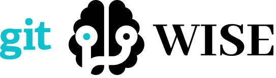

# Construcción de software y toma de decisiones

Ing. en Tecnologías Computacionales  
TC2005B Construcción de software y toma de decisiones [^1]

## Trabajo grupal: [GitWise](https://github.com/RodrigoTeran/natgas)
Natgas: Proyecto Onyx
   
 
  

## Trabajo individual
Repositorio grupal: [Chilaquiles](https://bitbucket.org/ejuarez/chilaquiles/)

### Labo 01
Introducción a las aplicaciones web, HTML5 y ciclo de vida de los sistemas de información

### Labo 03
CSS

### Labo 04
Fundamentos de Javascript

### Labo 05
Frameworks de estilo

### Labo 06
Programación orientada a eventos

### Labo 08
Introducción al back-end

### Labo 09
Bases de Datos de Escritorio (MS Access)

### Labo 10
Rutas y formas

### Labo 11
Express

### Labo 12
HTML dinámico

### Labo 13
MVC

### Labo 14
Manejo de sesiones y cookies

### Labo 15
Conociendo el ambiente de MariaDB

### Labo 16
Creación de constraints para instrumentar integridad referencial en MariaDB

### Labo 17
Interacción con la base de datos

### Labo 18
Autentificación

### Labo 19
Control de acceso basado en roles 

### Labo 20
Consultas en SQL

### Labo 21
SQL con funciones agregadas y sub-consultas

### Labo 22
Subir y bajar archivos

### Labo 23
Manipulación de datos usando Stored Procedures

### Labo 24
AJAX

### LABO 25
Transacciones

### LABO 26
Servicios web

[^1]: Profesores: Eduardo Daniel Juárez Pineda, Ricardo Cortés Espinosa  
      4to semestre FJ2023
